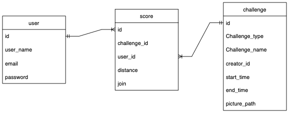

# Movement-Mapper-Backend
  

#### UW Bootcamp 
#### project-3

## Description

## Table of Contents 
    
  - [Contributors](#contributors)
  - [User Story](#user-story)
  - [Deployed link](#deployed-link)
  - [Table of Contents](#table-of-contents)
  - [Installation](#installation)
  - [Concepts](#concepts)
  - [Screenshots](#Screenshots)
  - [ERD](#erd)

## Contributors
*   Jonathan Tran
*   Nicole Franklin
*   Pablo Rosales
*   Saghar Behinaein
  
## User Story
As a user, I want to be able to create an exercise challenge so that I can motivate myself and my friends to be more active and lead a healthier lifestyle.

## Deployed link
[This backend link just responds with information for different routes](https://movementmapper-back.herokuapp.com/users)
  

## Installation
Here are some guidelines to help you get started:

1. Clone the back-end repo (this repo) 
2. Make sure you installed Node on your visual studio 
3. Make sure you installed MySQL and have it configured with your username & password
3. Run `npm i` command in your terminal in this repo's directory
5. Run `npm install express mysql2 sequelize dotenv bcrypt connect-session-sequelize express-session jsonwebtoken` comand in your terminal
6. Run `npm install cors` comand in your terminal
7.  Create a .env file, it should have:
    * DB_NAME=challenge_db
    * DB_PASSWORD=
    * DB_USER=root
    * SESSION_SECRET = super secret
    * JWT_SECRET= very secure
    * CLOUDINARY_API_KEY=
    * CLOUDINARY_API_SECRET=
    * CLOUDINARY_NAME=
8. For the DB_PASSWORD, make sure to use your password you made when installing MySQL
9. Sign up with cloudinary and create your api key, then copy the key, secret, and name and put in into the .env file
8. Open the terminal from server.js
9. run  `npm run schema` in terminal
10. run `npm run seed` in terminal
11. run `node start` in terminal

## Concepts
A Collaborative Challenge Invitation System
* Create an account & login
* Create new Challenge
* Delete Challenge
* Join Challenge
* Invite other users to your Challenge
* See Challenge created by other users
* Log activity
* Convert units
* Show the scores and present them in a chart

## Screenshots:  
* Login Page: 

* Home Page: 

* Dashboard Page: 

* Create an Challenge Page: 

* Dashboard Page for mobile: 

## ERD

